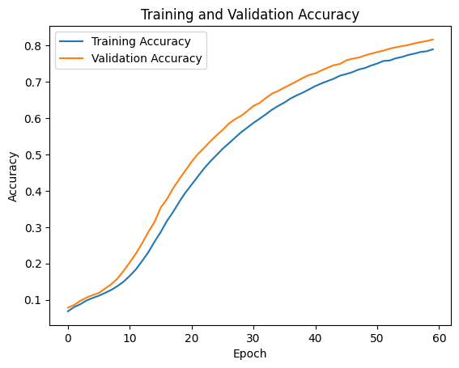
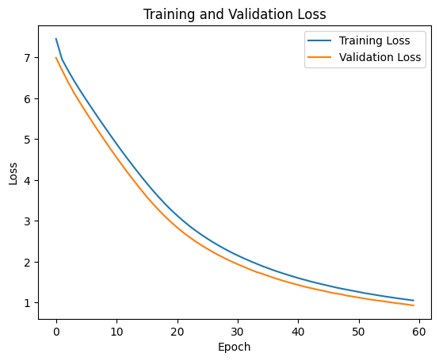
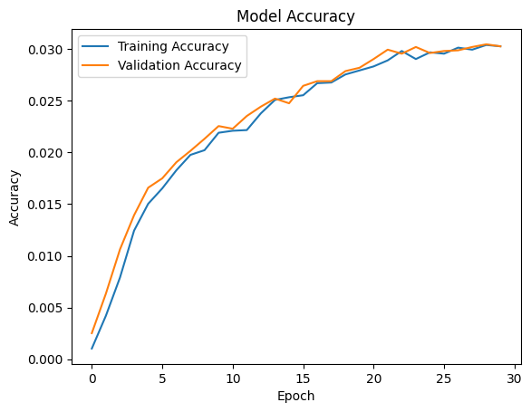
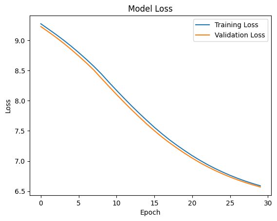

# Text Generation Using LSTM Networks: A Machine Learning Approach to Sequence-Based Language Modeling (NLP)

### ABSTRACT
This project focuses on developing a text
generation model using Long Short-Term Memory
(LSTM) networks, which are particularly effective for
sequential data like text. The goal of the project is to
create a machine learning model capable of generating
coherent and contextually relevant text based on an
input sequence. The model was trained on a large
corpus of text data, where the LSTM architecture
captured the dependencies and patterns of words in
sequences. Using techniques like tokenization,
embedding layers, and softmax activation, the model
predicts the next word in a sequence. The trained model
was evaluated based on accuracy, loss, and perplexity,
and its performance was visually assessed using
generated text examples. The results show that the
model successfully generates text with reasonable
coherence and creativity, making it suitable for
applications in content creation, automated storytelling,
and chatbots. Future work could involve fine-tuning the
model on specialized datasets to improve its
performance in specific domains. 

### 1. Introduction

*1.1 Problem Definition*
 
The objective of this project is to develop a machine
learning model for text generation using Long Short-
Term Memory (LSTM) networks. Text generation is a
crucial application in fields such as natural language
processing (NLP), content creation, and automated
storytelling. The goal is to create a model that can generate
coherent, contextually relevant text based on a given input,
mimicking the style and patterns of the training text data. 

*1.2 Solution Overview* 

The solution involves designing an LSTM-based model
capable of learning the intricate patterns in sequences of
text and generating new text samples that resemble the
style and structure of the original data. The model utilizes
deep learning techniques, particularly LSTM layers,
known for their effectiveness in learning from sequential
data. This approach is well-suited for text generation tasks
because LSTM networks are capable of capturing long-
range dependencies between words in a sequence. 
 
### MODEL ARCHITECTURE

**_2.2 Model Architecture__**
 
The LSTM-based text generation model consists of the following components: 
**• _Input Layer:_** 
◦ The input layer processes the text data, which is tokenized and encoded
into numerical representations. The input consists of a sequence of
words (or characters) that the model will learn to predict the next word
in the sequence .
**• _Embedding Layer:_** 
◦ An embedding layer is used to convert the input sequence of words
(represented as integers) into dense vectors of fixed size. This layer
helps the model learn semantic relationships between words. 
**•_ LSTM Layers:_**  
◦ The core of the model is composed of one or more LSTM layers. These
layers are designed to capture the sequential dependencies and temporal
patterns present in the text data. The output of each LSTM layer serves
as the input for the next layer, allowing the model to learn higher-level
representations. 
**_• Dense Layer:_** 
◦ A dense layer with a softmax activation function is used at the output.
This layer generates a probability distribution over the vocabulary,
predicting the likelihood of each possible word in the sequence. 
**•_ Output Layer:_** 
◦ The output layer generates the predicted next word in the sequence
based on the input. The model is trained to minimize the prediction error
and generate the most probable word at each step. 

**2.2 Loss Function** 
The model uses categorical cross-entropy as the loss function. This is suitable
for multi-class classification problems, where the goal is to predict the
probability distribution of the next word from a set of possible words.
Categorical cross-entropy helps minimize the difference between the predicted
and actual word distributions. 

**2.3 Optimizer** 
The optimizer used is Adam due to its efficiency and ability to handle sparse
gradients and adaptive learning rates. Adam is well-suited for training deep
learning models, offering faster convergence compared to traditional gradient
descent methods. 
• Learning Rate: The default learning rate is typically used (0.001), but it
may be adjusted based on model performance. 
• Other Parameters: Beta1 (0.9) and Beta2 (0.999) are the momentum
parameters for the Adam optimizer. 

**2.4 Training and Testing Results** 
The model was trained on a large text corpus, and the following metrics were
tracked: 
**• Accuracy**: Measures how well the model predicts the next word in the
sequence during training and testing. 
**• Loss:** Tracks the reduction in prediction error over time. 
Performance results were visualized, showing the loss and accuracy trends
during training and the quality of text generated after training. 
**Training Time: 2 hours
 Total Epochs: 60** 

**FINE TUNING**

**3. SYSTEM SPECIFICATION** 
**_3.1 Hardware Specifications_** 
• Processor: Intel Core i5-10700 or above 
• GPU: NVIDIA T4 graphics card or above 
• RAM: 12 GB or above 
• Storage: 512 GB SSD or above 

**_3.2 Software Specifications_** 

• Libraries/Dependencies: TensorFlow, Keras,
NumPy, Matplotlib , pickle  
• Development Environment: Jupyter Notebook,
Visual Studio Code 
 
# OUTPUT
The primary output of the model is the generated text based on a given input
sequence. The model produces a sequence of words that continues from the input text
in a coherent and contextually appropriate manner. 
_**• Example Output 1:**_ 
◦ Input: "Once upon a time" 
◦ Generated Output: "Once upon a time, in a faraway land, there was a
kingdom ruled by a wise king who loved his people.” 
**_• Example Output 2:_** 
◦ Input: "The future of AI" 
◦ Generated Output: "The future of AI is bright, with new advancements
in machine learning and deep learning paving the way for smarter
systems.” 
The model's performance is evaluated based on the shakeshepear text (contains all the
shakeshepare poem and drams ) 
 
 # CONCLUSION
The project successfully demonstrates the ability of LSTM
networks for generating coherent and contextually relevant text
based on a given prompt. The model learned the structure, syntax,
and style of the input data and was able to produce creative text
sequences. 
• Key Contributions: 
◦ Development of a robust LSTM-based text generation
model. 
◦ Efficient training pipeline for text-based sequential
data. 
• Future Work: 
◦ Further improvements can be made by experimenting
with advanced LSTM variants (e.g., Bidirectional
LSTMs, GRUs). 
◦ The model can be fine-tuned on specific genres or
styles of text for more personalized output. 
• Scalability and Adaptation: 
◦ The solution can be adapted for use in various
applications, such as chatbots, story generation, and
content creation. 
